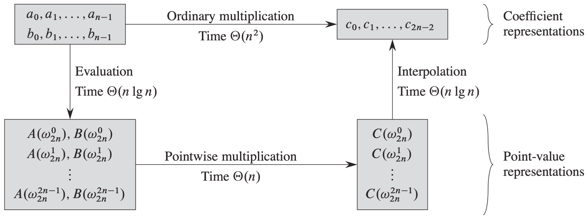

# 东半球最好的FFT讲义

🚅💰🔪🍃🔁

represented by 范乾一,邓智豪

> 🍅:阅读建议:若已了解问题,可直接从多项式章节的总结部分开始向后读.因为有关多项式背景介绍的内容大多摘自《算法导论》一书,且没有做精简,仅仅做了架构的跳转,故前半部分会显得冗长.而从多项式章节的总结部分开始是用自己语言重新组织过的内容,为了效率可以从这里开始读.

> "🍅:"意为笔者注.

Main Contribution:

1. 几乎是日常能用到的 FFT 知识的闭包.
2. 对系数表示下的乘法和点值表示下的按位乘以抽象代数的视角的说明了其为同构的群.

# 目录

[TOC]

# 目的

**实现两个多项式的快速相乘.**

应用:

# 导读

《算法导论》中的这张算法描述图非常清楚地描述了 FFT 的整体过程.整个算法的思路分成前后两部分.

第一部分是利用时域频域转换的思想,没有选择在原有形式的乘法上进行优化,而是在原问题的一个等价形式下找到了一种更优的计算方式来进行乘法.

第二部分则是利用复数根的性质以及分治法,来加速两种描述形式的转换,使得算法中的每一部分的复杂度都最终小于朴素乘法的复杂度.最终实现了多项式乘法的加速.

本文内容组织如下:

# 1. 多项式

这一章节我们仅仅考虑多项式的两种表现形式的等价,而不考虑期间转换所造成的消耗.即我们考虑对于一个多项式而言两种表示是惟一的,且两种形式下的两种乘法是等价的.

我们先介绍有关多项式的背景信息.

一个以$x$为变量的多项式定义在一个代数域$F$上,将函数$A(x)$表示为形式和:

$$
A(x)=\sum_{i=0}^{n-1} a_i x_i
$$

我们称$a_0,a_1,…,a_{n-1}$为如上多项式的系数,所有系数都属于域$F$,典型的情形是复数集合$C$. 

如果一个多项式A(x)的最高次的非零系数是$a_k$,则称$A(x)$的**次数**是k,记 $degree(A)=k$。

任何严格大于一个多项式次数的整数都是该多项式的**次数界**,因此,对于次数界为n的多项式,其次数可以是0~n-1之间的任何整数,包括0和n-1。

## 多项式表示方法

多项式的系数表达与点值表达是等价的,即用点值形式表示的多项式都对应唯一系数形式的多项式。在本节中,我们将介绍这两种表示方法,并展示如何把这两种表示法结合起来,以使两个次数界为n的多项式乘法运算在$O(nlgn)$时间内完成

###  系数表示

对一个次数界为n的多项式$A(x)=\sum_{i=0}^{n-1} a_i x_i$而言,其系数表达是一个由系数组成的向量$a=(a_0,a_1,…,a_{n-1})$。

#### 系数表示下的多项式加法

对于多项式加法,如果$A(x)$和$B(x)$是次数界为$n$的多项式,那么它们的和也是一个次数界为$n$的多项式$C(x)$.

对所有属于定义域的$x$,若求$C(x)=A(x)+B(x)$。也就是说,若

$$
A(x)=\sum_{i=0}^{n-1} a_i x_i\\
B(x)=\sum_{i=0}^{n-1} b_i x_i\\
C(x)=\sum_{i=0}^{n-1} c_i x_i
$$

其中$j=0, 1,\cdots, n-1,c_{j}=a_{j}+b_{j}$.

#### 系数表示下的多项式乘法

对于多项式乘法,如果$A(x)$和$B(x)$皆是次数界为$n$的多项式,则它们的乘积$C(x)$是一个次数界为$2n-1$的多项式.(最大即两个$c^{n-1}$相乘得$c^{2n-2}$)

对所有属于定义域的$x$,都有$C(x)=A(x)B(x)$。求$C$中每一项系数的一种算法是把$A(x)$中的每一项与$B(x)$中的每一项相乘,然后再合并同类项。

即:

$$
C(x)=\sum_{i=0}^{2n-2} c_i x_i
$$

其中,$c_i$表示为卷积运算.对变量次数为$i$的系数求值.

$$
c_i=\sum_{k=0}^i a_k b_{i-k}
$$

因为多项式乘法与卷积的计算都是最基本的计算问题,这些问题在实际应用中非常重要,所以若存在一个高效算法将非常地有意义。

#### 时间复杂度分析

1.求值运算

采用系数表达对于多项式的某些运算是很方便的。例如,对多项式$A(x)$在给定点$x_0$的求值运算就是计算$A(x)$的值。使用霍纳法则,我们可以在$O(n)$时间复杂度内完成求值运算: 

$$
A\left(x_{0}\right)=a_{0}+x_{0}\left(a_{1}+x_{0}\left(a_{2}+\cdots+x_{0}\left(a_{n-2}+x_{0}\left(a_{n-1}\right)\right) \cdots\right)\right)
$$

1. 加法运算

类似地,对两个分别用系数向量$(a_0,a_1,…,a_{n-1})$和b=$(b_0,b_1,…,b_{n-1})$表示的多项式进行相加时,所需的时间是 $O(n)$;我们仅输出系数向量$c=(c_0,c_1,…,c_{n-1})$,其中对$j=0,1,…n-1,c_i=a_i+b_i$。

3. 乘法运算

$$
c_i=\sum_{k=0}^i a_k b_{i-k}
$$

**因为对于每个$c_i$,得计算 i 次乘法,一共有 2n-1 个$c_i$,由求和公式易见,这种算法的复杂度为$O(n^2)$**

### 点值表示

一个次数界为n的多项式A(x)的点值表达就是一个由n个点值对所组成的集合
$$ \{(x_0,y_0),(x_1,y_1),…,(x_{n-1},x_{y-1})\}$$
对k=0,1,…,n-1,所有x,各不相同.

#### 点值表示下的加法运算

若 A 的点值表达式为:
$$
 \{(x_0,y_0),(x_1,y_1),…,(x_{n-1},y_{n-1})\}
$$

且 B 的点值表达式为:
$$
 \{(x_0,y'_0),(x_1,y'_1),…,(x_{n-1},y'_{n-1})\}
$$

那么 C = A + B 的点值表达式即为:

$$
 \{(x_0,y_0+y'_0),(x_1,y_1+y'_1),…,(x_{n-1},y'_{n-1}+y'_{n-1})\}
$$

因此,对两个点值形式表示的次数界为n的多项式相加,所需时间复杂度为$O(n)$。

#### 点值表示下的乘法运算

类似地,对于多项式乘法,点值表达也是方便的。如果$C(x)=A(x)B(x)$,则对于任意点$x_i$,$C(x_i)=A(x_i)B(x_i)$.

那么,对A的点值表达和B的点值表达进行逐点相乘,

$$
\{(x_0,y_0y'_0),(x_1,y_1y'_1),…,(x_{n-1},y'_{n-1}y'_{n-1})\}
$$

所得到的点值对若**足够多**以至于能充分表示 C,就可得到C的点值表达。易见,由于只做了 n 次乘法,故时间复杂度依然为$O(n)$.

为什么强调足够多呢?因为我们必须面对这样一个问题,即 $degree(C)= degree(A)+ degree(B)$;如果A和B次数界为$n$,那么C的次数界为$2n$。

一般而言,对于A和B每个多项式而言,一个标准点值表达是由n个点值对所组成。当我们把这些点值对相乘,就得到C的n个点值对.

但是,由于C的次数界为2n,要插值获得唯一的多项式C,我们需要2n个点值对。

因此,必须对A和B的点值表达进行“扩展”**(即用系数表示事先算好 2n 个点值对)**.

#### 点值表达的拓展

对于多项式乘法,如果$C(x)=A(x)B(x)$,则对于任意点$x_k,C(x_k)=A(x_k)B(x_k)$,即对A的点值表达和B的点值表达进行逐点相乘,就可得到C的点值表达。

但是,在插值的时候.我们也必须面对这样一个问题,即 $degree(C)= degree(A)+ degre(B)$.如果A和B次数界为n,那么C的次数界为2n。

对于A和B每个多项式而言,一个标准点值表达是由n个点值对所组成。当我们把这些点值对相乘,就得到C的n个点值对,由于C的次数界为2n,要插值获得唯一的多项式C,我们需要2n个点值对。

## 两种表示形式的相互转换

### 逆矩阵

事实上,当我们已知点对又已知目标多项式次数界的情况下,我们要做的只不过是解下列方程而已.

即,设系数表示的向量为$[a_i]$,求其满足过每一个点值对的取值尔.

$$
\left[\begin{array}{ccccc}{1} & {x_{0}} & {x_{0}^{2}} & {\cdots} & {x_{0}^{n-1}} \\ {1} & {x_{1}} & {x_{1}^{2}} & {\cdots} & {x_{1}^{n-1}} \\ {\vdots} & {\vdots} & {\vdots} & {\ddots} & {\vdots} \\ {1} & {x_{n-1}} & {x_{n-1}^{2}} & {\cdots} & {x_{n-1}^{n-1}}\end{array}\right]\left[\begin{array}{c}{a_{0}} \\ {a_{1}} \\ {\vdots} \\ {a_{n-1}}\end{array}\right]=\left[\begin{array}{c}{y_{0}} \\ {y_{1}} \\ {\vdots} \\ {y_{n-1}}\end{array}\right]
$$

要证明插值多项式的唯一性,只需证上述方程存在的逆矩阵尔.
事实上上述矩阵为范德蒙德矩阵,其行列式即为:
$$
\prod_{0\leqslant j<k\leqslant n-1}(x_k-x_j)
$$

> ***补充内容-范德蒙德行列式的证明:***

用数学归纳法进行证明.考虑 n 阶范德蒙德行列式,从第n行开始，自上而下依次的由下一行减去它上一行的$x_1$倍(这里是列,不过可将其转置之后再求行列式,即符合上述说明过程),以第一列行列展开后提取公因式即得.)
$$
D_{n}=\left|\begin{array}{cccc}{1} & {1} & {\dots} & {1} \\ {x_{1}} & {x_{2}} & {\dots} & {x_{n}} \\ {\vdots} & {\vdots} & {} & {\vdots} \\ {x_{1}^{n-1}} & {x_{2}^{n-1}} & {\dots} & {x_{n}^{n-1}}\end{array}\right|\\
$$
$$
D_{n}=\left|\begin{array}{ccccc}{1} & {1} & {1} & {\cdots} & {1} \\ {0} & {x_{2}-x_{1}} & {x_{3}-x_{1}} & {\cdots} & {x_{n}-x_{1}} \\ {0} & {x_{2}^{2}-x_{2} x_{1}} & {x_{3}^{2}-x_{3} x_{1}} & {\cdots} & {x_{n}^{2}-x_{n} x_{1}} \\ {\vdots} & {\vdots} & {\vdots} & {} & {\vdots} \\ {0} & {x_{2}^{n-1}-x_{2}^{n-2} x_{1}} & {x_{3}^{n-1}-x_{3}^{n-2} x_{1}} & {\cdots} & {x_{n}^{n-1}-x_{n}^{n-2} x_{1}}\end{array}\right|\\
$$
$$
=\left|\begin{array}{ccccc}{1} & {1} & {1} & {\cdots} & {1} \\ {0} & {x_{2}-x_{1}} & {x_{3}-x_{1}} & {\cdots} & {x_{n}-x_{1}} \\ {0} & {x_{2}\left(x_{2}-x_{1}\right)} & {x_{3}\left(x_{3}-x_{1}\right)} & {\cdots} & {x_{n}\left(x_{n}-x_{1}\right)} \\ {\vdots} & {} & {\vdots} & {} & {\vdots} \\ {0} & {x_{2}^{n-2}\left(x_{2}-x_{1}\right)} & {x_{3}^{n-2}\left(x_{3}-x_{1}\right)} & {\cdots} & {x_{n}^{n-2}\left(x_{n}-x_{1}\right)}\end{array}\right|\\
$$
$$
D_{n}=\left(x_{2}-x_{1}\right)\left(x_{3}-x_{1}\right) \cdots\left(x_{n}-x_{1}\right)\left|\begin{array}{cccc}{1} & {1} & {\cdots} & {1} \\ {x_{2}} & {x_{3}} & {\cdots} & {x_{n}} \\ {\vdots} & {\vdots} & {} & {\vdots} \\ {x_{2}^{n-2}} & {x_{3}^{n-2}} & {\ldots} & {x_{n}^{n-2}}\end{array}\right|
$$
归纳可得:
$$
\prod_{0\leqslant j<k\leqslant n-1}(x_k-x_j)
$$

> ***补充内容-范德蒙德行列式的证明(完)***

那么如果x皆不同,该行列式不为零,由逆矩阵定理,该矩阵是可逆的。
因此,给定点值表达我们能够唯一确定系数$a$.
$$
a=V(x_0,x_1,...x_n-1)^{-1}y
$$

**因此,必须对A和B的点值表达进行“扩展”,使每个多项式都包含2n个点值对。**

我们必须先用系数表达算出 2n个值来求 C 的点值表达,再对其插值.

## 总结

第一部分其实只用三句话即可总结:

1. 证明了系数表示有其唯一对于的点值表示.因为对于给定的 n 个点直接求值即可得到.

2. 证明了点值表示有其唯一对应的系数表示.因为点值对满足一定条件下可用方程组解出唯一的系数向量.

3. 证明了两种乘法等价.

由此,我们可以将系数表示下的多项式乘法$\cdot$转成点值表示下的按位乘$\times$进行运算.

但是,如果大家群论还没忘记,这一部分可用一句话进行总结!

给定次数界$n$时,群$(系数表示集合,\cdot)$与群$(点值表示集合,\cdot)$之间存在双射$f$,且$f$是两群上的同构满足$f(A\cdot B)=f(A)\times f(B)$.

### 补充内容-两种乘法等价的严格证明
> ***补充内容-两种乘法等价的严格证明: BEGIN***

> 🍅:大家都是离散数学的高手,离散数学都考了好多分,都考了九十多分.那么,我就在这里稍微啰嗦两句.用大家都学过的群论按定义证一遍.

我们现在证明系数表示下的多项式乘法与点值表示下的多项式乘法是等价的.在后文中,我们称前一种乘法为乘法,后一种一种乘法为按位乘.且若无声明,均设所讨论多项式次数界为 $n$.

#### 双射

我们先证明两种表示形式是等价的.我们考虑$A(x)=\sum_{i=0}^{n-1} a_i x_i$以及$(a_0,a_1,…,a_{n-1})$.

我们先从系数表示出发推点值表示.

考虑$A(x)=\sum_{i=0}^{n-1} a_i x_i$转其点值表示.对于取定的 n 个点$\{x_0,x_1,…,x_{n-1}\}$,我们依次对其中的每个点进行求值,便得到$\{(x_0,y_0),(x_1,y_1),…,(x_{n-1},y_{n-1})\}$,根据定义,"一个次数界为$n$的多项式$A(x)$的点值表达就是一个由其上$n$个点值对所组成的集合",我们得到$A(x)$的点值表示.由于对于给定的参数 $A(x)$ 只有唯一的值,我们得到的在$\{x_0,x_1,…,x_{n-1}\}$上$A(x)$点值表示是唯一的.

现在从点值表示推系数表示.

对于在$\{x_0,x_1,…,x_{n-1}\}$上取值的点值表示$A=\{(x_0,y_0),(x_1,y_1),…,(x_{n-1},y_{n-1})\}$,我们要求其系数表示$A(x)=\sum_{i=0}^{n-1} a_i x_i$,即要求其系数.那么我们可以通过解下列方程来确定唯一的系数向量$[a_i]$.

$$
\left[\begin{array}{ccccc}{1} & {x_{0}} & {x_{0}^{2}} & {\cdots} & {x_{0}^{n-1}} \\ {1} & {x_{1}} & {x_{1}^{2}} & {\cdots} & {x_{1}^{n-1}} \\ {\vdots} & {\vdots} & {\vdots} & {\ddots} & {\vdots} \\ {1} & {x_{n-1}} & {x_{n-1}^{2}} & {\cdots} & {x_{n-1}^{n-1}}\end{array}\right]\left[\begin{array}{c}{a_{0}} \\ {a_{1}} \\ {\vdots} \\ {a_{n-1}}\end{array}\right]=\left[\begin{array}{c}{y_{0}} \\ {y_{1}} \\ {\vdots} \\ {y_{n-1}}\end{array}\right]
$$

要证明求得的系数表示唯一,即要求系数向量唯一,即要求上述方程的解唯一,即要求上式方程组中的系数矩阵可逆.由于其行列式为$\prod_{0\leqslant j<k\leqslant n-1}(x_k-x_j)$,故只要求$\{x_0,x_1,…,x_{n-1}\}$中元素互异,言即我们的点值对是$n$个不同的点上取值的点值对时,上述方程便有唯一解.

即对于$\{x_0,x_1,…,x_{n-1}\}$上取值的点值表示$A=\{(x_0,y_0),(x_1,y_1),…,(x_{n-1},y_{n-1})\}$有唯一对应的系数表示.

事实上可逆矩阵的存在再次证明了由系数表示求得的数值表示是惟一的.

由此,我们证明了任何一个系数表示都有与其一一对应的点值表示. 记上述从系数表示到点值表示的映射为$f$.

#### 同构

我们现在证明分别定义在两者至上的乘法和按位乘也是等价的.

我们已经证明了集合$F_{actor}=\{A(x)=\sum_{i=0}^{n-1} a_i x_i|a_i \in C\}$与集合$P_{oint\ value}=\{\{(x_0,y_0),(x_1,y_1),…,(x_{n-1},y_{n-1})\}|(x_i,y_y)\in C\times C \}$之间存在一一映射.

我们在这两个定义集合上分别定义一个二元运算$\cdot$和$\times$,这两个二元运算便是乘法和按位乘.
对于点值表示,我们容易验证这个二元运算满足封闭性,结合律,存在单位元和逆元,其构成一个群.
对于系数表示,我们容易同样容易验证这个二元运算满足封闭性,结合律,.对于系数表示下的单位元即是常数 $1$ .对于稀疏表示下的逆元容易由数学归纳法证得,这里不再赘述.

终于,我们想在将我们的问题转化成一个群同构证明的问题.我们现在证明,上文所描述的映射$f$是$F$到$P$上的同构.即证:

$$f(A\cdot B)=f(A)\times f(B)$$

即证,A 与 B 的乘积的像等于 A 与 B 的像按位乘.

对于左边,$A$与$B$的乘积为$C(x)=A(x)B(x)$.其像为$C(x)$于$\{x_0,x_1,…,x_{2n-1}\}$上取值得到点值对:
$$
\{(x_0,C(x_0)),(x_1,C(x_1)),…,(x_{n-1},C(x_{2n-1}))\}
$$
根据 $C(x)$ 的定义,当只考虑一个值上的取值的时候我们实际不用算出其系数表示,直接对$A$与$B$在给定的点进行求值,两个数相乘直接得到$C(x_i)$.故上述点值对集合可改写为:
$$
\{(x_0,A(x_0)B(x_0)),(x_1,A(x_1)B(x_1)),…,(x_{n-1},A(x_{2n-1})B(x_{2n-1}))\}
$$

对于右边,先得 A 和 B 的像分别为:
$$
\{(x_0,A(x_0)),(x_1,A(x_1)),…,(x_{n-1},A(x_{2n-1}))\}\\
\{(x_0,B(x_0)),(x_1,B(x_1)),…,(x_{n-1},B(x_{2n-1}))\}
$$

根据按位乘的定义,有:

$$
\{(x_0,A(x_0)B(x_0)),(x_1,A(x_1)B(x_1)),…,(x_{n-1},A(x_{2n-1})B(x_{2n-1}))\}
$$

得证对于任意的$x$等式两边相等.由此我们证明映射$f$是$F$到$P$上的同构.至此,我们可以放心的将系数表示下的乘法运算转到点值表达下按位乘运算,因为两者是等价的.

容易产生迷惑的便是上述最后的两步即如何证明等式两边相等.乍一看仿佛循环论证或是重复.这里仅仅是碰巧按位乘以及$C(x)=A(x)B(x)$的求值落在实际计算都是复数相乘而已.不妨考虑按位乘或者$C(x)=A(x)B(x)$的求值是某种更诡谲的运算,在此处反而更好理解.

> ***补充内容-两种乘法等价的严格证明: END***

# 2. 复分析光速入门

简略谈谈复数及复数根的三个性质.

## 复数的指数形式

$$
e^{i\theta}=cos(\theta)+isin(\theta)
$$

> ***补充内容-欧拉公式证明: BEGIN***

一个复数$z=a+ib$可以表示为复平面上的一点$(a,b)$.那么由其几何表示可联想极坐标下的模长与夹角的表示法.
复数的模长表示为 $z=\rho cos(\theta) + i\rho sin(\theta)=\rho (cos(\theta)+isin(\theta))$
令$z(\theta)$为关于$\theta$的函数.对$z(\theta)$进行求导,有:
$$
z'(\theta)=\rho(-sin(\theta)+icos(\theta))
$$
整理:
$$
z'(\theta)=i\rho(isin(\theta)+cos(\theta))
$$
得:
$$
z'(\theta)=i\rho z(\theta)
$$
解该微分方程,易见其通解为:
$$
z(\theta)=Ce^{i\rho\theta}
$$
最后将初始条件带入可得$C=\rho$.最后,取单位向量,即令$\rho=1$,便得欧拉公式:
$$
e^{i\theta}=cos(\theta)+isin(\theta)
$$

> ***补充内容-欧拉公式证明 END***

## 单位复数根

n 次单位复数根是满足$\omega^n=1$的复数$w$.

那么,由复数的指数定义,对于满足条件的复数$w$有:
$$
w^n=e^{ni\theta}=1
$$
要使上述等式成立,当且 
$$
n\theta=2k\pi\Rightarrow \theta=2k\pi/n
$$
那么 n 次单位复数根即可表示为:
$$
w^k_n = e^{i\frac{2\pi k}{n}}
$$
因为任何大于 2π的次数都可拆下来由欧拉公式消成幺元.故 n 次单位复数根恰好有 n 个.

### 消去引理

$$
对 \forall\ n \geqslant 0,k\geqslant 0, d \gt 0,有w^{dk}_{dn}=w^{k}_{n}
$$

证明:因为 $w^{dk}_{dn} = e^{\frac{2\pi dk}{dn}}=e^{\frac{2\pi k}{n}}=w^{k}_{n}$

### 折半引理

$$
如果 n>0为偶数,\\那么 n 个 n 次单位复数根的平方的集合就是 n/2 个 n/2 次单位复数根的集合.
$$

证明:因为$\left(\omega_{n}^{k+n / 2}\right)^{2}=\omega_{n}^{2 k+n}=\omega_{n}^{2 k} \omega_{n}^{n}=\omega_{n}^{2 k}=\left(\omega_{n}^{k}\right)^{2}$,即$\omega_{n}^{k+n / 2}$与$\omega_{n}^{k}$平方相同.

$(w^{k+n/2}_n)^2 = (e^{i\frac{2\pi (k+n/2)}{n}})^2 = e^{i\frac{2\pi (2k+n)}{n}}=e^{i\frac{2\pi 2k}{n}+2\pi}=e^{i\frac{2\pi 2k}{n}}=(e^{i\frac{2\pi k}{n}})^2 = (w^{k}_n)^2$

### 求和引理

**对任意整数 $n\geqslant 1$和不能被 n 整除的非负整数 k,有:**

**$$\sum_{j=0}^{n-1}\left(\omega_{n}^{k}\right)^{j}=0$$**

证明:
可列式证明:

$$
\sum_{j=0}^{n-1}\left(\omega_{n}^{k}\right)^{j}=\frac{\left(\omega_{n}^{k}\right)^{n}-1}{\omega_{n}^{k}-1}=\frac{\left(\omega_{n}^{n}\right)^{k}-1}{\omega_{n}^{k}-1}=\frac{(1)^{k}-1}{\omega_{n}^{k}-1}=0
$$

>🍅:但直观上看,可以说明为复平面上的每一个单位向量都存在一个与之反向的单位向量使得两者相加为零.

>只需解这个方程:

$$
\frac{2\pi k}{n} i +\pi \equiv \frac{2\pi k}{n}j \pmod{2\pi}
$$

>大家都是初等数学的高手,高考数学都考了好多分,而且这里位置太少我也写不下,所以就不赘述了.

## 总结

第二部分依然可以用三句话总结:

1. 消去引理:$对 \forall\ n \geqslant 0,k\geqslant 0, d \gt 0,有w^{dk}_{dn}=w^{k}_{n}$

2.  折半引理:如果 $n>0$为偶数,那么 n 个 n 次单位复数根的平方的集合就是 $n/2$ 个 $n/2$ 次单位复数根的集合.

3. 求和引理:对任意整数 $n\geqslant 1$和不能被 n 整除的非负整数 k,有:$\sum_{j=0}^{n-1}\left(\omega_{n}^{k}\right)^{j}=0$

# 3. FT

## DFT

离散傅里叶变换,即求次数界为 n 的多项式$A(x)=\sum_{i=0}^{n-1} a_i x_i$在$\omega_{n}^{0}, \quad \omega_{n}^{1}, \quad \omega_{n}^{2}, \quad \cdots, \quad \omega_{n}^{n-1}$处的点值表示.

定义结果$y_k$:
$$y_{k}=A\left(\omega_{n}^{k}\right)=\sum_{j=0}^{m-1} a_{j} \omega_{n}^{k j}$$

那么向量$y=(y_0,y_1,...,y_{n-1})$就是系数向量$a=(a_0,a_1,...,a_{n-1})$的离散傅里叶变换.记$$y=DFT_n(a)$$

## FFT

通过使用一种称为快速傅里叶变换(FFT)的方法,利用复数单位根的特殊性质,我们就可以在$⊙(nlgn)$时间内计算出$DFT_n(a)$,而直接的方法所需时间为$O(n^2)$。

**通篇假设n恰好是2的整数幂。处理非2的整数幂的策略在代码实现中交代.**

接下来的内容包括四个关键的处理,将以1️⃣2️⃣3️⃣4️⃣标明,希望引起读者注意.

### 求值

我们需要计算:

$$
y_{k}=A\left(\omega_{n}^{k}\right)=a_{0}(\omega_{n}^{k})^0+a_{1}(\omega_{n}^{k})^1+a_{2} (\omega_{n}^{k})^2+\cdots+a_{n-1} (\omega_{n}^{k})^{n-1}\\,y=0,1,...,n-1
$$

我们考虑如何优化。

#### 分治

这里我们考虑分治法来对这个问题进行优化。

为了分治,我们需要把问题写成与原问题相同的子问题.为了达成这个目标,我们先把问题写成形构相似的两个表达式.

##### 1️⃣关键处理其一:分奇偶拆分

我们对

$$
A(x) = a_{0}+a_{1}x+a_{2} x^{2}+\cdots+a_{n-1} x^{n-1}
$$

做下述拆解.即将其奇数偶数拿出来.

$$
\begin{array}{l}{A_{even}(x)=a_{0}+a_{2} x^2+a_{4} x^{4}+\cdots+a_{n-2} x^{n-2}}\\{A_{odd}(x)=a_{1}x+a_{3} x^3+a_{5} x^{5}+\cdots+a_{n-1} x^{n-1}}\end{array}
$$

再整理,得形构更相同的形式:

$$
A_{odd}(x)=x(a_{1}+a_{3} x^2+a_{5} x^{4}+\cdots+a_{n-1} x^{n-2})
$$

为了将其化为规模更小子问题,我们得把这两个次数界为{}{}的多项式化成次数界更小的两个多项式.事实上结果呼之欲出.令

$$
\begin{array}{l}{A^{[0]}(x)=a_{0}+a_{2} x+a_{4} x^{2}+\cdots+a_{n-2} x^{n / 2-1}} \\ {A^{[1]}(x)=a_{1}+a_{3} x+a_{5} x^{2}+\cdots+a_{n-1} x^{n / 2-1}}\end{array}
$$

那么:

$$
\begin{array}{l}
A_{even}(x)=A^{[0]}(x^2)\\
A_{odd}(x)=xA^{[1]}(x^2)
\end{array}
$$

故:

$$
A = A^{[0]}(x^2) + xA^{[1]}(x^2)
$$

现在,问题由求$A(x)$在$\omega_{n}^{0}, \quad \omega_{n}^{1}, \cdots, \quad \omega_{n}^{n-1}$求值的问题转化为$A^{[0]},A^{[1]}$在$\left(\omega_{n}^{0}\right)^{2},\left(\omega_{n}^{1}\right)^{2}, \cdots,\left(\omega_{n}^{n-1}\right)^{2}$求值的问题.

虽然我们把这个问题分治了,但我们对问题进行复杂度分析发现.我们优雅地把一个$T(n) = n^2$问题化成了$n\cdot (2 \cdot n/2)=n\cdot (2 \cdot 2 \cdot (n/4))=...=O(n^2)$问题.第一个 n 指单位次方根个数,第二个 n 指乘法次数.简直是太棒了!我们甚至还加入了额外的函数调用及归并步骤!正如有诗云:一顿操作猛如虎,定睛一看,原地杵.👍👏

#### 利用单位复数根性质

##### 2️⃣关键处理其二: 利用折半引理加速

所以正如我们所见,朴素的分治法依然是一个$O(n^2)$的问题.现在,让我们用上复数根的性质.

根据折半引理,上式并不是由n个不同值组成,而是仅由n/2个n/2次单位复数根所组成,每个根正好出现2次。

在此处算法的体现即是意思是,对平方后的复数根再开根,仅是符号不同:(从下往上读)
$$
\begin{aligned} y_{k} &=y_{k}^{[0]}+\omega_{n}^{k} y_{k}^{[1]} \\ &=A^{[0]}\left(\omega_{n}^{2 k}\right)+\omega_{n}^{k} A^{[1]}\left(\omega_{n}^{2 k}\right) \\ &=A\left(\omega_{n}^{k}\right) \end{aligned}
$$
$$
\begin{aligned} y_{k+(n / 2)} &=y_{k}^{[0]}-\omega_{n}^{k} y_{k}^{[1]} \\ &=y_{k}^{[0]}+\omega_{k}^{k+(m / 2)} y_{k}^{[1]} \\ &=A^{[0]}\left(\omega_{n}^{2 k}\right)+\omega_{n}^{k+(m / 2)} A^{[1]}\left(\omega_{n}^{2 k}\right) \\ &=A^{[0]}\left(\omega_{n}^{2 k+n}\right)+\omega_{n}^{k+(n / 2)} A^{[1]}\left(\omega_{n}^{2 k+n}\right) \\ &=A\left(\omega_{n}^{k+(m / 2)}\right) \end{aligned}
$$

因此,我们递归地对次数界为$n/2$的多项式$A^{[0]}(x)$和$A^{[1]}(x)$在$n/2$个$n/2$次单位复数根处进行求值。这些子问题与原始问题形式相同,但规模变为一半。现在, 我们才成功地把一个$n$个元素的$DFT$。计算划分为两个规模为$n/2$个元素的$DFT$计算.

综上,有FFT算法:
$$
\begin{array}{l}{\text { RECURSIVE-FFT(a) }} \\ {\text { 1 } n=a \text { .length }} \\ {\text { 2 if } n=1} \\ {\text { 3 } \quad \text { return } a} \\ {\text { 4 } \omega_{n}=\mathrm{e}^{2 \pi i n}} \\ {\text { 5 } \omega_{n}=1} \\ {\text { 6 } a^{[0]}=\left(a_{0}, a_{2}, \cdots, a_{n-1}\right)} \\ {\text { 7 } a^{[1]}=\left(a_{1}, a_{3}, \cdots, a_{n-1}\right)} \\ {\text { 8 } y^{[0]}=\operatorname{RECURSIVE-FFT}\left(a^{[0]}\right)}\\{\text { 9 } y^{\text {[1] }}=\operatorname{RECURSIVE-FFT}\left(a^{[1]}\right)} \\ {\text { 10 for } k=0 \text { to } n / 2-1} \\ {\text { 11 } \quad y_{k}=y_{i k}^{(0)}+\omega y_{i}^{[1]}} \\ {\text { 12 } \quad y_{k+(w / 2)}=y_{i j}^{[0]}-\omega y_{i}^{[1]}} \\ {\text { 13 } \quad \omega=\omega \omega_{n}} \\ {14 \text { return y } \quad \text { // } y \text { is assumed to be a column vector }}\end{array}
$$

### 插值

类似于常规的插值,我们同样可以把插值过程写成求向量$a$的过程.列出方程$y=V_{n} a$如下:

$$
\left[\begin{array}{c}{y_{0}} \\ {y_{1}} \\ {y_{2}} \\ {y_{3}} \\ {\vdots} \\ {y_{n-1}}\end{array}\right]=\left[\begin{array}{cccccc}{1} & {1} & {1} & {1} & {\cdots} & {1} \\ {1} & {\omega_{n}} & {\omega_{n}^{2}} & {\omega_{n}^{3}} & {\cdots} & {\omega_{n}^{n-1}} \\ {1} & {\omega_{n}^{2}} & {\omega_{n}^{4}} & {\omega_{n}^{6}} & {\cdots} & {\omega_{n}^{2(n-1)}} \\ {1} & {\omega_{n}^{3}} & {\omega_{n}^{6}} & {\omega_{n}^{9}} & {\cdots} & {\omega_{n}^{3(n-1)}} \\ {\vdots} & {\vdots} & {\vdots} & {\vdots} & {\ddots} & {\vdots} \\ {1} & {\omega_{n}^{n-1}} & {\omega_{n}^{2(n-1)}} & {\omega_{n}^{3(n-1)}} & {\cdots} & {\omega_{n}^{(n-1)(n-1)}}\end{array}\right]\left[\begin{array}{c}{a_{0}} \\ {a_{1}} \\ {a_{2}} \\ {a_{3}} \\ {\vdots} \\ {a_{n-1}}\end{array}\right]
$$

我们同样求其逆矩阵$V^{-1}_n$.这里引出一个定理:

$$
对 j,k = 0,1,...,n-1,V^{-1}_n 的(j,k)处元素为 w^{-jk}_n/n.
$$

这个定理看起来极其地不可思议,因为他实际上说明**逆矩阵仅由原矩阵取共轭并除以 n 便可立即得到.**,根本不需要再像上文中一般形式下繁琐地求解其逆矩阵.

> 🍅：直接给出这个定理且不给证明当然看起来是相当非常不可思议.事实上这个部分涉及一段比较长但并不是很困难的证明.相信在座的各位都是矩阵论(随口一说,并没有涉及)或者是线代的高手,都考了好多分考了九十多分,都可以熟练运用经目测得进行证明,而且这里地方太小我写不下那个绝妙的证明,我也便不写了.相关证明方法贴在了 ref 处,欢迎查阅.这里也是一个及其关键的需要证明的处理,就给他个5️⃣吧.

证明:

##### 3️⃣关键处理其三: 利用求和引理证明

考虑$(j,j')$处元素.
$$
\left[V_{n}^{-1} V_{n}\right]_{j j^{\prime}}=\sum_{k=0}^{n-1}\left(\omega_{n}^{-k j} / n\right)\left(\omega_{n}^{kj^{\prime}}\right)=\sum_{k=0}^{n-1} \omega_{n}^{k\left(j^{\prime}-j\right)} / n
$$
由求和引理,当且仅当$j'=j$时式子为 1,即对角线元素为1 而其他元素为零.得证.

##### 4️⃣关键处理其四: 利用形构相似实现逆变换

最后,求各系数。由于
$$
a_{j}=\frac{1}{n} \sum_{k=0}^{n-1} y_{k} \omega_{n}^{-k j}
$$
形构相似于
$$
y_{k}=A\left(\omega_{n}^{k}\right)=\sum_{j=0}^{n-1} a_{j} \omega_{n}^{k j}
$$

我们便同样用快速傅里叶变换算法计算插值,实现快速傅里叶逆变换.

事实上 IFFT 有四种写法。这里仅是其中最易实现的，有兴趣的同学可查阅 ref.

# ref

1. 算法导论
2. 浅谈范德蒙德(Vandermonde)方阵的逆矩阵与拉格朗日(Lagrange)插值的关系以及快速傅里叶变换(FFT)中IDFT的原理 :https://www.cnblogs.com/gzy-cjoier/p/9741950.html
3. Vandermonde 矩陣的逆矩陣公式:https://ccjou.wordpress.com/2012/06/13/vandermonde-%E7%9F%A9%E9%99%A3%E7%9A%84%E9%80%86%E7%9F%A9%E9%99%A3%E5%85%AC%E5%BC%8F/

4. 茴香豆的四种写法：https://www.dsprelated.com/showarticle/800.php